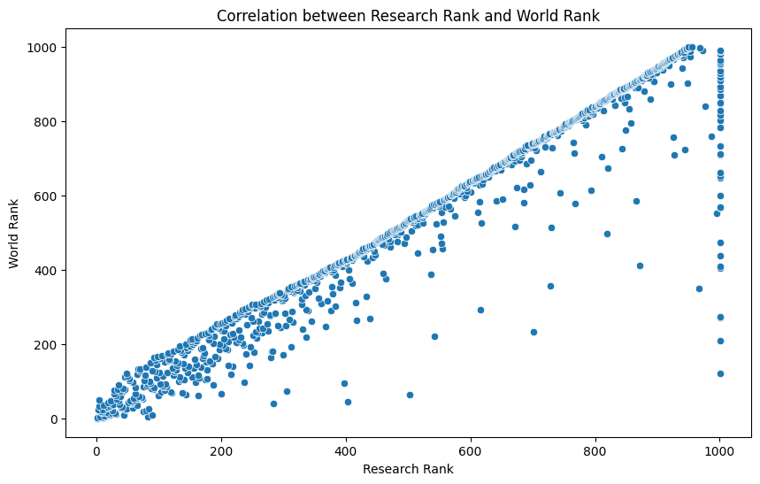
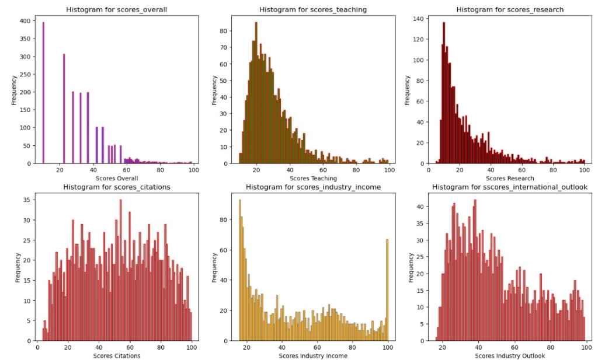

# World-University-Ranks
## Team Members 
- Ahmed AlHarbi
- Mushal Alshagha
- Hamad Alruways
- Yousef Alharbi
## Overview
This repository contains a Jupyter Notebook designed for Exploratory Data Analysis (EDA). The notebook provides a structured approach to analyzing datasets, identifying patterns, and visualizing key insights.
## Datasets
- shanghai_ranking_2024: https://www.kaggle.com/datasets/computingvictor/2024-academic-ranking-of-world-universities
- Times World University Rankings 2024: https://www.kaggle.com/datasets/ddosad/timesworlduniversityrankings2024
- Times Higher Education World University Rankings 2024: https://www.timeshighereducation.com/world-university-rankings/2024/world-ranking
## Four Key Steps of EDA
### 1️- Data Profiling  
- Understanding the dataset structure  
- Checking data types, missing values, and summary statistics  
- Identifying potential issues such as outliers and inconsistencies  

### 2️- Data Cleaning  
- Handling missing values (imputation or removal)  
- Removing duplicates and inconsistencies  
- Standardizing formats for better analysis  

### 3️- Univariate Analysis  
- Analyzing single variables independently  
- Generating summary statistics (mean, median, mode, etc.)  
- Visualizing distributions using histograms, box plots, and KDE plots  

### 4️- Bivariate & Multivariate Analysis  
- Exploring relationships between two or more variables  
- Using scatter plots, heatmaps, and correlation matrices  
- Identifying trends and dependencies between variables

## Insights


 This scatter plot demonstrates a strong positive correlation between Research Rank and World Rank. As Research Rank increases, World Rank rises accordingly, showing a clear direct relationship. The data points are closely grouped along a diagonal line, emphasizing the consistent connection between the two metrics. However, a few points show slight deviations, implying that other factors may affect World Rank in addition to Research Rank.

 
 This line chart illustrates a negative correlation between University Rank and Score. As University Rank increases (indicating a lower ranking), the Score declines. The sharp drop in Score at the beginning suggests that top-ranked universities achieve significantly higher scores. As the rank worsens, the curve levels off, indicating smaller score variations among lower-ranked institutions.

  
  Overall Scores:
This histogram presents the distribution of overall scores, with most values concentrated in the lower ranges. The majority of institutions score between 20 and 40, peaking around the 20-30 range. A noticeable right-skewed tail suggests that while most institutions achieve lower scores, a select few attain significantly higher overall results.

Teaching Scores:
The teaching scores histogram shows a more balanced distribution compared to overall scores. Most scores fall between 40 and 80, indicating a relatively consistent level of teaching quality across institutions. The distribution is less skewed, implying that extreme teaching scores either very high or very low are less common.

Research Scores:
The research scores histogram reveals a broad range of performance, with a pronounced skew towards the lower end. A large number of institutions score below 20, while higher research scores become progressively less frequent. This suggests that achieving significant research output and impact is challenging for most institutions.

Citation Scores:
This histogram highlights a highly skewed distribution of citation scores. The majority of institutions have relatively low citation scores, creating a tall cluster on the left. A long tail extends to the right, representing a small number of institutions with exceptionally high citation impact. This reflects a significant disparity in research influence across institutions.

Industry Income Scores:
The industry income scores histogram shows a concentration in the lower to middle ranges, with most values between 20 and 60 and a peak around 30-40. The positively skewed distribution suggests that while most institutions generate moderate industry income, only a few achieve substantially higher levels due to strong industry partnerships and commercialization efforts.

International Outlook Scores:
This histogram depicts a fairly balanced distribution of international outlook scores, with a slight right skew. Scores are primarily concentrated between 40 and 80, indicating that many institutions maintain a solid international presence. However, the skew suggests that achieving an exceptionally high level of internationalization is relatively rare.

  

This visualization presents box plots for six score categories, enabling distribution comparisons.
Each box plot displays the median, quartiles, and outliers for a specific score category.
Scores Overall has a narrow interquartile range (IQR), indicating low variability.
Scores Teaching shows a wider IQR, reflecting diverse teaching scores among institutions.
Scores Research has a lower median and compressed IQR, suggesting limited variation.
Scores Citations exhibits high variability with a long tail of outliers, showing citation disparities.
Scores Industry Income and Scores International Outlook have moderate variability with distinct medians.
Outliers appear as points beyond the whiskers, representing extreme scores.
The visualization highlights differences in central tendency and dispersion across categories.
Overall, the box plots provide insight into score distributions and institutional performance.


  
  This bar chart displays the gender distribution across ten top-ranked universities. Each university's bar is divided into two segments, representing the percentage of male and female students. The data reveals varying gender balances across institutions, with some having a higher percentage of males and others with a more even distribution. For instance, California Institute of Technology shows a significantly higher male representation, while other universities like Harvard and Yale demonstrate closer to a 50/50 split. The chart allows for a quick visual comparison of gender diversity in higher education among these prominent universities.

## How to Use  
1. Clone the repository or download the notebook.  
2. Open the Jupyter Notebook using:  

   ```bash
   jupyter notebook "EDA explain template.ipynb"
   ```
   
3. Run the cells step by step.

## Conclusion 
This template provides a structured approach to performing EDA efficiently. Feel free to modify and expand it based on your dataset and analysis goals.  
